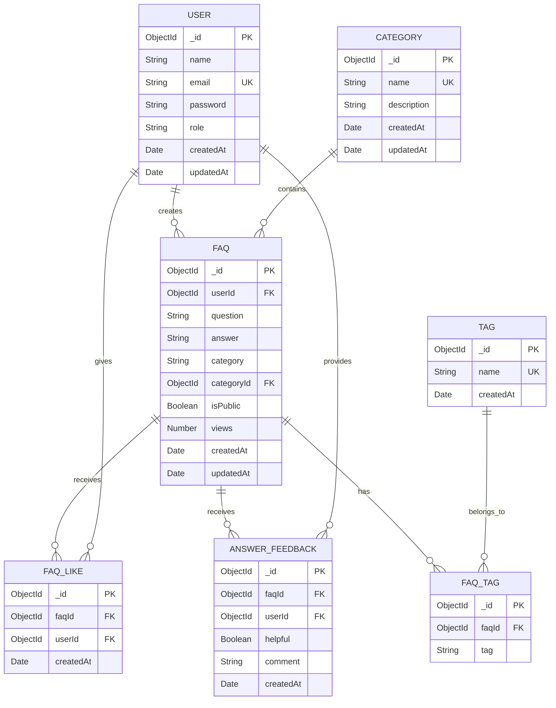

# AI FAQ Assistant API – ER Diagram

## Entity Relationship Diagram

## Entity Descriptions

### 1. USER
Stores user authentication and account information.
- `_id` – Primary Key (ObjectId)
- `name` – User name
- `email` – Unique email address
- `password` – Hashed password
- `role` – User/Admin role
- `createdAt` – Account creation date
- `updatedAt` – Last update date

### 2. FAQ
Stores frequently asked questions and their answers.
- `_id` – Primary Key
- `userId` – Foreign Key referencing USER
- `question` – FAQ question
- `answer` – FAQ answer
- `categoryId` – Foreign Key referencing CATEGORY
- `category` – Category name
- `isPublic` – Public visibility status
- `views` – Number of views
- `createdAt` – Creation date
- `updatedAt` – Last update date

### 3. CATEGORY
Organizes FAQs into different categories.
- `_id` – Primary Key
- `name` – Unique category name
- `description` – Category description
- `createdAt` – Creation date
- `updatedAt` – Last update date

### 4. FAQ_LIKE
Stores user likes/reactions for FAQs.
- `_id` – Primary Key
- `faqId` – Foreign Key referencing FAQ
- `userId` – Foreign Key referencing USER
- `createdAt` – Like creation date

### 5. ANSWER_FEEDBACK
Stores feedback given by users for FAQ answers.
- `_id` – Primary Key
- `faqId` – Foreign Key referencing FAQ
- `userId` – Foreign Key referencing USER
- `helpful` – Whether the answer was helpful
- `comment` – Optional feedback comment
- `createdAt` – Feedback creation date

### 6. FAQ_TAG
Connects FAQs with tags.
- `_id` – Primary Key
- `faqId` – Foreign Key referencing FAQ
- `tag` – Tag value

### 7. TAG
Stores reusable tags for FAQ organization.
- `_id` – Primary Key
- `name` – Unique tag name
- `createdAt` – Tag creation date

## Relationship Summary

- One USER can create many FAQs.
- One CATEGORY can contain many FAQs.
- One FAQ can receive many likes.
- One USER can like many FAQs.
- One FAQ can receive many feedback entries.
- One USER can provide many feedback entries.
- One FAQ can have many tags.
- Tags can be associated with multiple FAQs through FAQ_TAG.

## AI Generation (Logical Component)

AI-generated FAQ content is produced dynamically using Google Gemini AI before persistence. The logical fields are:

- `topic`
- `generatedQuestion`
- `generatedAnswer`
- `generatedCategory`
- `generatedAt`

These fields represent the AI-generation process and do not need to be stored as a separate physical collection unless required by the implementation.
